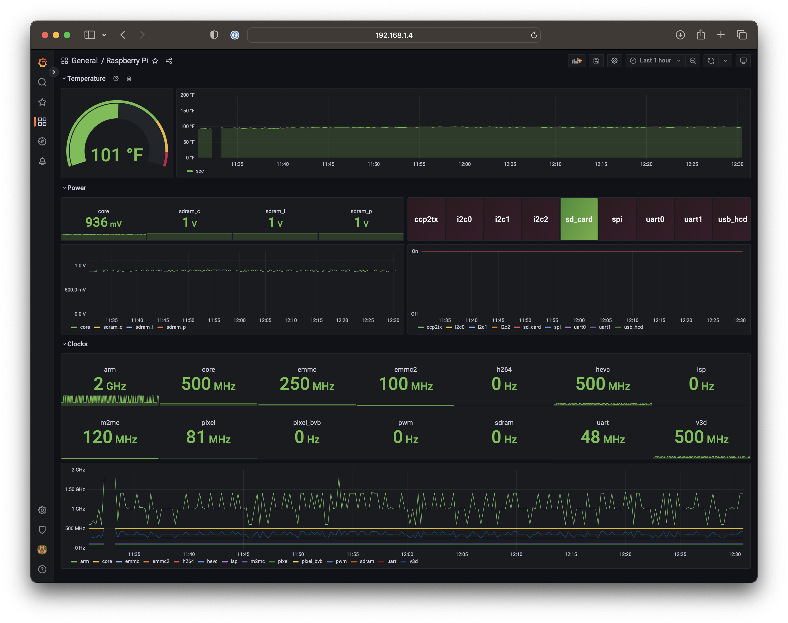

# rpi_exporter

A Prometheus exporter for Raspberry Pi hardware metrics.



Grafana Dashboard: [JSON model](assets/grafana_dashboard.json?raw=1)

# Installation

## Install binary

```shell
# Install to /opt/node_exporter
$ make install
```

## Configure systemd

```ini
# /etc/systemd/system/rpi_exporter.service
[Unit]
Description=Raspberry Pi Exporter

[Service]
ExecStart=/opt/node_exporter/rpi_exporter -addr=:9110

[Install]
WantedBy=multi-user.target
```

```shell
$ sudo systemctl daemon-reload
$ sudo systemctl enable rpi_exporter.service
$ sudo systemctl start rpi_exporter.service
```

## Configure Prometheus

```yaml
# /etc/prometheus/prometheus.yml
scrape_configs:
  - job_name: "rpi_exporter"
    scrape_interval: 5s
    static_configs:
      - targets: ["localhost:9110"]
```

```shell
$ sudo systemctl restart prometheus.service
```
